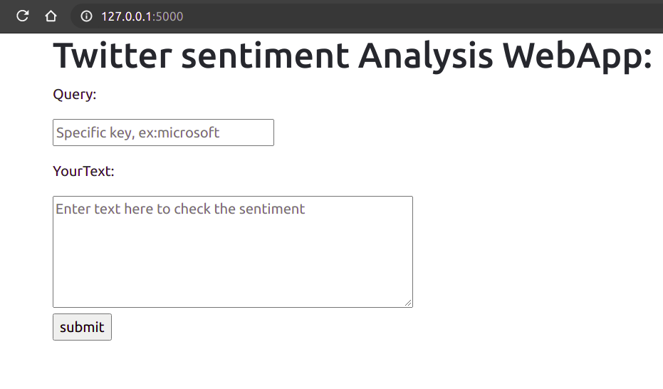
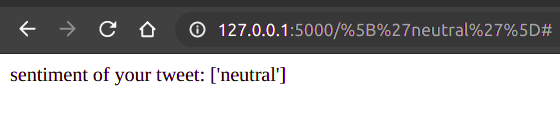

**##### <h1>Twitter sentiment Analysis WebApp: Flask</h1>**

Major aim of this app is to build a simple flask web app
to scrape the twitter data based on the provided filter term.
Random forest classifier will be built around the scrapped data
and user entered piece of text will be analysed, at the end
sentiment will be displayed based on current learned model.

<h2>Download: How to run</h2>
Would you want to create a new virtual environment
please look for a related documentation: https://docs.python.org/3/tutorial/venv.html

clone the repo and Navigate to SentimentWebApp.

**#### **Note:You need to create the twitter developer account and 
get the required api key,token for the app to work.
TwitterApiConfig.py needs to be replaced with the obtained key and token.****

<pre>(base) <b>~/Downloads</b>$ git clone https://github.com/hraja101/SentimentWebApp
</pre>
<pre>(base) <b>~/Downloads</b>$ cd SentimentWebApp/
</pre>

#### **Install the requirements with the pip command**
<pre>(base) <b>~/Downloads/SentimentWebApp</b>$ pip install -r requirements.txt </pre>

Navigate to src directory
<pre>(base) <b>~/Downloads/SentimentWebApp</b>$ cd src/</pre>
Run the python file to start the webapp
<pre>(base) <b>~/Downloads/SentimentWebApp/src</b>$ python WebApiSentiment.py 
</pre>

**Web App Interface:**

Enter the search query to scrape the twitter and collect the data , 
for example : "covid" and enter your text -> to check the sentiment of your text.

